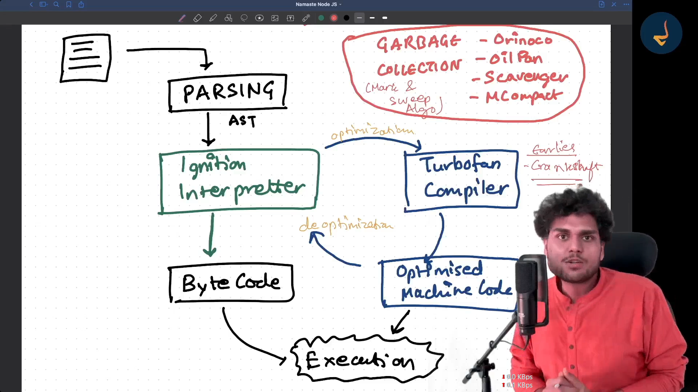

# NodeJs Learning 
  
  - Cross-platform - can run on windows , macos and linux etc
  - javascript maintain by Open Js foundation
  - even-driven architecture
  - non-blocking i/o
  - Developed by `Rayn Dall`
  - 

# done 
 - Sync code
 - Async code 
 - Blocking Sync code 
 - setTimeout((cbfn),0)
 - Not Blocking I/O
 - Mian thread
 - Asynchronous I/O
 - Libuv Github

# Diving Deep into V8 
 - stages of execution of code in v8
   - Parsing
   - Lexical Analysis (Tokenization)  
     code convert into token
   - Syntax Analysis (parsing)
     AST - Abstract syntax Tree
   - AST --> Interpreter ( in vs - Ignition interpreter) -------> TurboFan compiler    (optimiZation)
                |                                         (Hot)        |
             Byte code                                           Optimised machine Code                  
                |                                                      | 
            Execution---------------------------------------------- Execution           
    * Hot - that code or function will use again and again 
          - will compile so later on it will execute faster 

  - Inline caching // read yourself
  - copy Elision // read yourself
   
# Type of language
 - Two Types of language
   - 1. interpreted Language - 
     - Line by line
     - Fast Initial execute
     - interpretter
   - 2.  Compiled Language
     - First compilation 
        - High level code  -> Machine code
     - Initially heavy but executed fast
     - Compilers

# javascript both ( interpreted & compiled)
 - javascript uses interpreter and compiler to work
 - compilation method is known as in js - JIT Compiler ( Just in time compiled)
