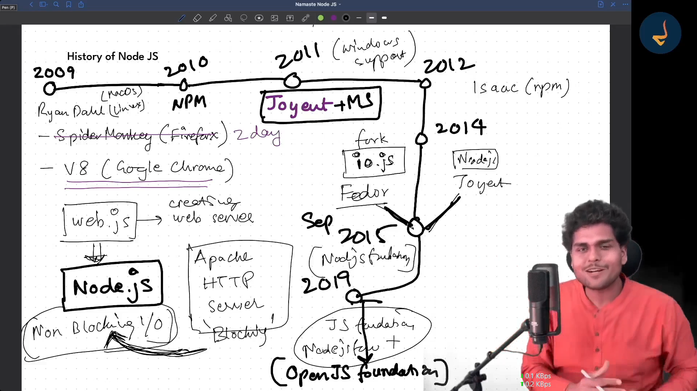

# NodeJs Learning 
  
  - Cross-platform - can run on windows , macos and linux etc
  - javascript maintain by Open Js foundation
  - even-driven architecture
  - non-blocking i/o
  - Developed by `Rayn Dall`
  - 